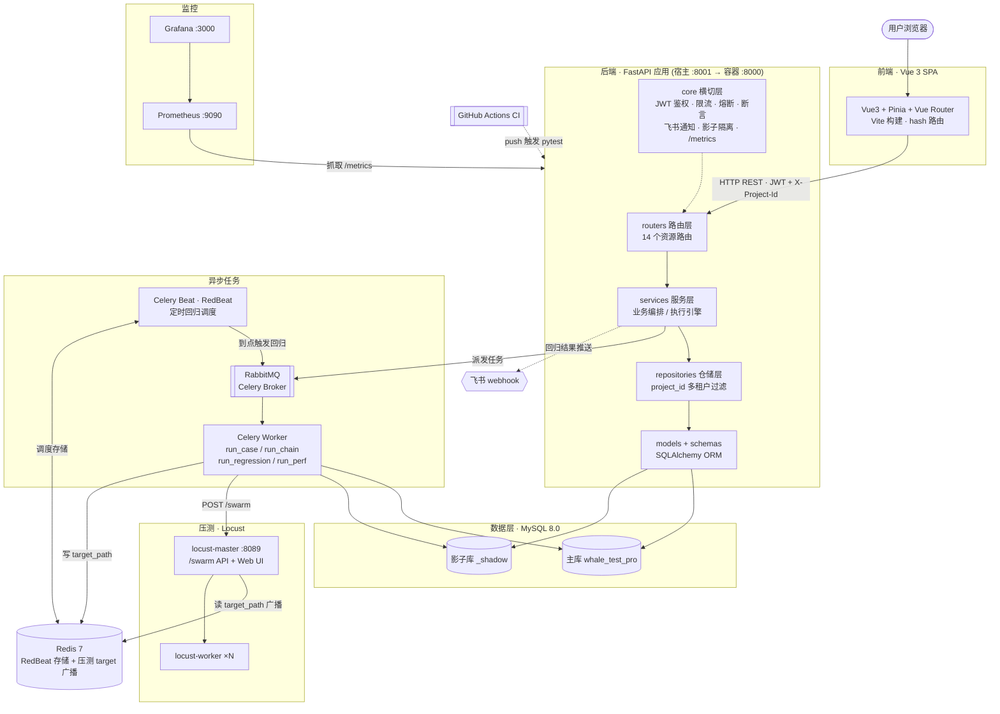

# WhaleTestPro

团队协作型接口测试平台:在「项目」隔离的空间内维护接口 / 用例 / 环境 / 场景 / Mock,并可执行用例、跑回归、压测、录制与回放流量。后端 FastAPI 五层架构 + Celery 异步,前端 Vue 3,一套 Docker Compose 一键拉起。

## 功能特性

- **项目与成员** — 所有资源按 `project_id` 隔离,支持 owner / admin / member 角色、成员维护与项目级权限校验。
- **接口管理** — 接口定义 + 单层分类,支持编辑。
- **测试用例** — 用例 CRUD、标签、断言、变量提取、setup/teardown SQL、重试、数据集。
- **场景编排** — 五层结构可视化编排,链式提参串联多接口。
- **回归测试** — 按标签 / 全量跑用例,统计通过率与接口覆盖率,可选飞书通知。
- **Mock 挡板** — 按 path / method 匹配返回挡板响应,支持延时、自定义状态码。
- **定时调度** — Celery Beat / RedBeat,按 cron 周期触发定时回归。
- **测试报告** — 单用例报告分页统计;场景执行生成一份场景报告与多条步骤明细。
- **压测** — Locust master / worker 驱动,实时指标进 Prometheus / Grafana。
- **流量录制 / 回放** — 中间件录制真实流量,可按环境回放。
- **可观测性** — `/metrics` 暴露 Prometheus 指标,Grafana 看板。
- **稳定性机制** — JWT `jti` 级登出隔离、限流、熔断器、影子库隔离与项目资产事务删除。

## 系统架构


```mermaid
flowchart TB
    User(["用户浏览器"])

    subgraph FE["前端 · Vue 3 SPA"]
      Vue["Vue3 + Pinia + Vue Router<br/>Vite 构建 · hash 路由"]
    end

    subgraph APP["后端 · FastAPI 应用 (宿主 :8001 → 容器 :8000)"]
      direction TB
      Router["routers 路由层<br/>14 个资源路由"]
      Service["services 服务层<br/>业务编排 / 执行引擎"]
      Repo["repositories 仓储层<br/>project_id 多租户过滤"]
      Model["models + schemas<br/>SQLAlchemy ORM"]
      Core["core 横切层<br/>JWT 鉴权 · 限流 · 熔断 · 断言<br/>飞书通知 · 影子隔离 · /metrics"]
      Router --> Service --> Repo --> Model
      Core -.-> Router
    end

    subgraph DATA["数据层 · MySQL 8.0"]
      Main[("主库 whale_test_pro")]
      Shadow[("影子库 _shadow")]
    end

    subgraph ASYNC["异步任务"]
      MQ[["RabbitMQ<br/>Celery Broker"]]
      Worker["Celery Worker<br/>run_case / run_chain<br/>run_regression / run_perf"]
      Beat["Celery Beat · RedBeat<br/>定时回归调度"]
    end

    Redis[("Redis 7<br/>RedBeat 存储 + 压测 target 广播")]

    subgraph PERF["压测 · Locust"]
      LMaster["locust-master :8089<br/>/swarm API + Web UI"]
      LWorker["locust-worker ×N"]
    end

    subgraph OBS["监控"]
      Prom["Prometheus :9090"]
      Graf["Grafana :3000"]
    end

    Feishu{{"飞书 webhook"}}
    CI[["GitHub Actions CI"]]

    User --> Vue
    Vue -->|"HTTP REST · JWT + X-Project-Id"| Router
    Model --> Main
    Model --> Shadow
    Service -->|"派发任务"| MQ
    MQ --> Worker
    Beat -->|"到点触发回归"| MQ
    Beat <-->|"调度存储"| Redis
    Worker --> Main
    Worker --> Shadow
    Worker -->|"POST /swarm"| LMaster
    Worker -->|"写 target_path"| Redis
    LMaster -->|"读 target_path 广播"| Redis
    LMaster --> LWorker
    Prom -->|"抓取 /metrics"| APP
    Graf --> Prom
    Service -.->|"回归结果推送"| Feishu
    CI -.->|"push 触发 pytest"| APP
```

## 技术栈

| 层 | 技术 |
|----|------|
| 前端 | Vue 3 · Pinia · Vue Router · Vite |
| 后端 | FastAPI · SQLAlchemy · Pydantic(五层:router → service → repository → model/schema)|
| 数据库 | MySQL 8.0(主库 + 影子库隔离)|
| 异步 | Celery + RabbitMQ(broker)· Celery Beat / RedBeat(定时,存 Redis)|
| 压测 | Locust(master / worker,可水平扩容)|
| 监控 | Prometheus + Grafana |
| 部署 / CI | Docker Compose 一键起 · GitHub Actions |

## 快速开始

### 方式一:Docker Compose(推荐)

一条命令拉起整套:前端(Nginx)、后端、MySQL、Redis、RabbitMQ、Celery Worker、Prometheus、Grafana、Locust。

1. 在项目根准备 `.env`:

   ```dotenv
   MYSQL_ROOT_PASSWORD=你的密码
   SECRET_KEY=改成一段随机字符串
   FEISHU_WEBHOOK=
   ```

2. 一键启动:

   ```bash
   docker compose up -d --build
   ```

3. 打开浏览器访问 **http://localhost:8080** —— 即完整平台。前端由 Nginx 托管打包产物,`/api` 反代到后端容器,无需单独起前端。

> MySQL 首次初始化会通过 `docker/mysql/init/01-create-shadow-db.sql` 创建影子库;后端随后通过 `create_all` 在主库和影子库建表。初始化脚本只在空数据卷首次启动时执行。

> 前端热开发(可选):改前端代码想热更新时,可另起 vite dev server —— `cd frontend && npm install && npm run dev`(http://localhost:5173,`/api` 经 vite 代理到后端 8001)。日常部署/演示走 8080 的 Nginx 容器即可。

### 方式二:本地起后端(不走 Docker)

需本机自备 MySQL / Redis / RabbitMQ,并把 `.env` 里的主机名改为 `127.0.0.1`。

```bash
pip install -r requirements.txt
python main.py                                   # uvicorn 127.0.0.1:8000(带 reload)
celery -A app.core.celery_app worker -l info     # 另开终端:Celery Worker
```

> 注:`main.py` 本地默认监听 `8000`,而前端代理指向 `8001`;本地起后端时把 `frontend/vite.config.js` 的 proxy target 改为 `8000`,或用 `uvicorn main:app --port 8001` 起。

## 端口一览

| 服务 | 地址 |
|------|------|
| 前端(Nginx 容器)| http://localhost:8080 |
| 后端 API / Swagger | http://localhost:8001/docs |
| 前端(vite dev,可选)| http://localhost:5173 |
| RabbitMQ 管理台 | http://localhost:15672 |
| Prometheus | http://localhost:9090 |
| Grafana | http://localhost:3000 |
| Locust Web UI | http://localhost:8089 |

## 目录结构

```
├── app/                # 后端 FastAPI
│   ├── routers/        # 路由层(14 个资源路由)
│   ├── services/       # 服务层(业务编排 / 执行引擎)
│   ├── repositories/   # 仓储层(project_id 多租户过滤)
│   ├── models/         # SQLAlchemy 模型
│   ├── schemas/        # Pydantic 模型
│   ├── tasks/          # Celery 异步任务
│   └── core/           # 横切:鉴权 / 限流 / 熔断 / 断言 / 通知 / 调度 / 影子
├── frontend/           # 前端 Vue 3 + Vite(含 Dockerfile + nginx.conf 容器化)
├── migrations/         # 增量 SQL 迁移
├── tests/              # pytest 单测
├── docker/             # Prometheus / Grafana 配置
│   └── mysql/init/     # MySQL 首次启动初始化影子库
├── scripts/deploy.sh   # 云服务器拉取、构建、健康检查部署脚本
├── docs/               # 需求文档 / 测试用例 / 缺陷记录 / 部署说明
├── locustfile.py       # 压测脚本
├── main.py             # 后端入口
├── docker-compose.yml  # 一键起
└── Dockerfile
```

## 测试

```bash
pytest                 # 运行 tests/ 下单测
```

CI 走 GitHub Actions,push 自动 checkout → 装依赖 → 跑 pytest。

发布前建议完成一轮本地验收:

```bash
pytest
cd frontend && npm run build
cd ..
sudo docker compose config --quiet
sudo docker compose ps -a
curl -fsS http://127.0.0.1:8001/health
curl -fsS http://127.0.0.1:8080/api/health
```

业务 API 的成功响应统一为 `code: 0`、`message` 和 `data`;失败响应保留对应 HTTP 状态码,并将状态码写入 `code`。删除接口使用 `200 + data: null`。完整契约见 [`docs/api-response.md`](docs/api-response.md),独立黑盒验收见 [WhaleTestPro-APITest](https://github.com/zixuan-come/WhaleTestPro-APITest)。

独立黑盒接口测试位于 [WhaleTestPro-APITest](https://github.com/zixuan-come/WhaleTestPro-APITest),通过 HTTP 验证鉴权、项目隔离、资源 CRUD、执行链路和报告契约,不 import 本仓库代码。

## 文档

| 文档 | 说明 |
|------|------|
| [`docs/需求文档/README.md`](docs/需求文档/README.md) | 按功能拆分的当前需求基线（13 个业务域，含权限、流程、异常与验收标准）|
| [`docs/spec.md`](docs/spec.md) | 内部规格书 / 需求文档(16 模块,只描述真实行为)|
| [docs/api-response.md](docs/api-response.md) | 业务 API 统一响应结构与异常处理规范 |
| [`docs/deployment.md`](docs/deployment.md) | Ubuntu 云服务器首次部署、日常更新、健康检查与排障 |
| [`docs/bugs.md`](docs/bugs.md) | 缺陷总账(全局编号 + 交叉引用)|
| [`docs/测试缺陷/`](docs/测试缺陷/) | 缺陷按模块拆分归档(功能 / 接口)|
| [`docs/testcases_api.xlsx`](docs/testcases_api.xlsx) | 接口测试用例(361 条)|
| [`docs/testcases_func.xlsx`](docs/testcases_func.xlsx) | 功能测试用例(216 条)|
